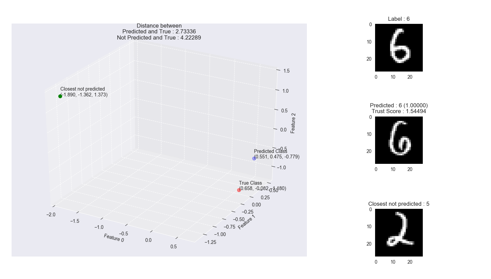

How can I trust you?
===

# Comparing deep learning models using trust score

## Introduction

Several efforts to improve deep learning performance have been done through the years, but there are only few works towards better understanding the models and their predictions, and whether they should be trusted or not. Since the re-emergence of neural networks in 2012 by famously winning the ImageNet Challenge (Krizhevsky et al., 2012), we have employed deep learning models in a variety of real-world applications--to the point where we always resort to deep learning to solve even the simplest problems. Such applications range from recommendation systems (Cheng et al., 2016) to medical diagnosis (Gulshan et al., 2016). However, despite the state-of-the-art performance of deep learning models in these specialized tasks, they are not infallible from committing mistakes, in which the degree of seriousness of such mistakes vary per application domain.

## Results

Each model was trained for 60 epochs with a mini-batch size of 512 on the MNIST dataset (LeCun et al., 1998), resulting to 7,020 training steps. Both the 2-layer FFNN and LeNet-5 CNN were trained using SGD with Momentum (learning rate = 0.1, momentum = 0.9), with a learning rate decay of 1e-6. As for the mini-VGG CNN, it was trained using Adam (Kingma et al., 2014) with a learning rate of 0.01.

The test accuracy for each model together with their number of parameters are written in Table 1.

|**Architecture**|**No. of Params.**|**Test Accuracy**|
|----------------|------------------|-----------------|
|2-layer FFNN    |669,706           | 98.20%          |
|LeNet           |44,426            |98.08%           |
|**Mini-VGG**    |**329,962**       |**98.62% (+0.42%)**|

**Table 1. Test accuracy of the deep learning models on the MNIST handwritten digits classification dataset.**

To compute the trust score for our deep learning models, we used their model predictions as the input — but in the original paper by Jiang et al. (2018), they also used the different learned representations of features instead of the model predictions alone. In Figure 4, we have the Trust Score and Model Confidence curves for correctly classified examples (Figure 4 (a-c), Detect Trustworthy) and misclassified examples (Figure 4 (d-f), Detect Suspicious). These plots depict the performance (i.e. the y-axis) of the trained classifiers at a given percentile level (i.e. the x-axis).


**Figure 1. Trust score results using 2-layer FFNN, LeNet-5, and Mini-VGG on MNIST dataset. Top row is detecting trustworthy; bottom row is detecting suspicious.**

The vertical black lines in Figure 4 (a-c) denote the error level of the trained classifier while the vertical black lines in Figure 4 (d-f) denote the accuracy level of the trained classifiers. From both performance metrics, we can see that the trained classifier with both high test accuracy and trust score is the 2-layer FFNN — which is somehow not surprising in a way that it had the most number of parameters, and surprising in a way that despite its simpler architecture compared to our CNN-based models, it outperformed both in this test. To be fair, our CNN-based models were trained from scratch whereas in the original paper, they used a pre-trained VGG classifier and pre-trained smaller CNN classifiers.

In Figure 2, we can see the position of the test example x in the 3D feature space, together with the predicted class h and the closest not predicted class ĥ (left side of the figure). We can also see the numerical distance between x and h, and the numerical distance between x and ĥ. In addition, we can also see the test image x, the predicted class h (along with the likelihood and trust score), and the closest not predicted class ĥ at the right side of the figure.



From Figure 5, we can confirm visually and numerically the distances among the points x, ĥ, and h. With the distance d(ĥ, x) being higher (i.e. 4.22289) than the distance d(h, x) (i.e. 2.73336), we can confirm the trust score given at the right side of the figure, 1.54494. Can the model prediction be trusted? Visually? Yes. We can see the plotted points where the x and h are much closer together than x and ĥ are, and the plotted images at the right in Figure 5 support the class prediction. Numerically? Yes. We can see the numerical distance among points, and compute the ratio between these numerical distances.

## License

```
Copyright 2019 Abien Fred Agarap

Licensed under the Apache License, Version 2.0 (the "License");
you may not use this file except in compliance with the License.
You may obtain a copy of the License at

    http://www.apache.org/licenses/LICENSE-2.0

Unless required by applicable law or agreed to in writing, software
distributed under the License is distributed on an "AS IS" BASIS,
WITHOUT WARRANTIES OR CONDITIONS OF ANY KIND, either express or implied.
See the License for the specific language governing permissions and
limitations under the License.
```
